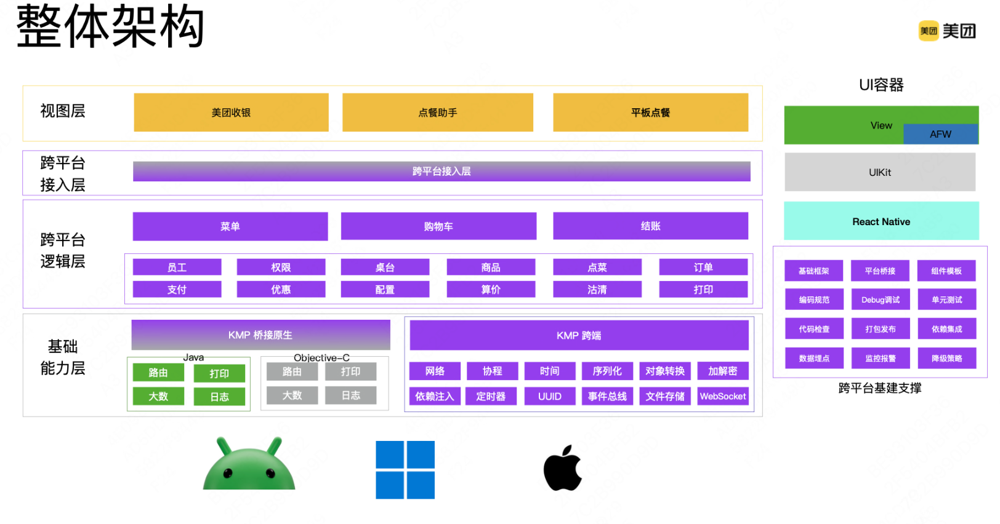
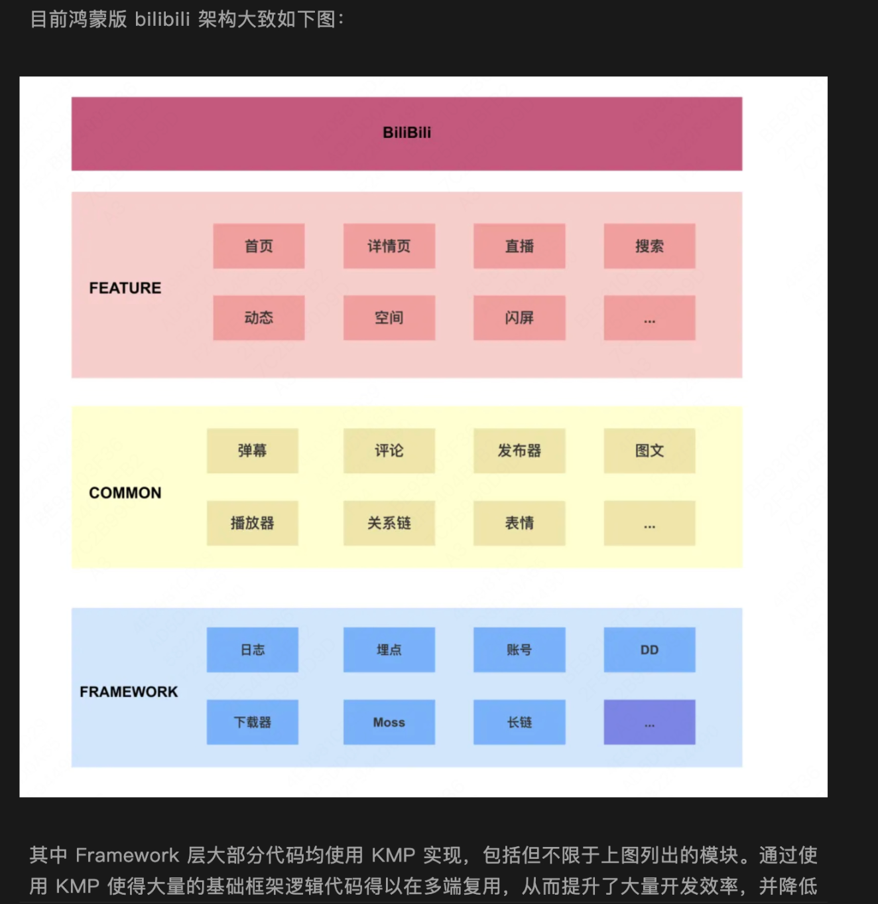
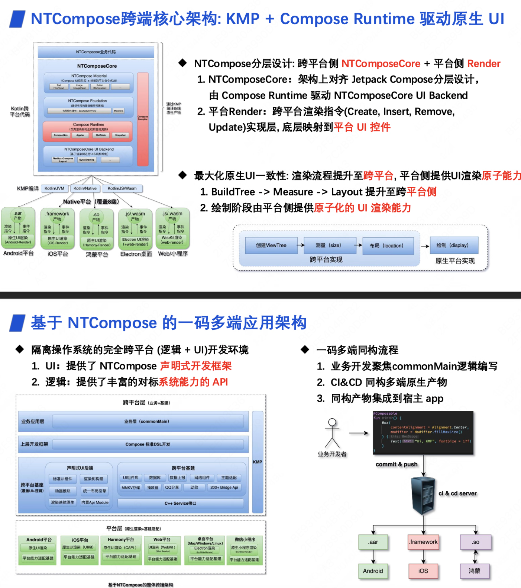
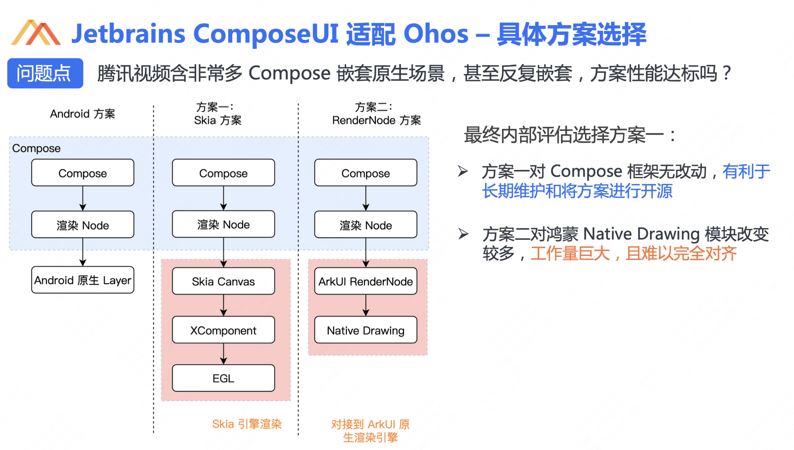
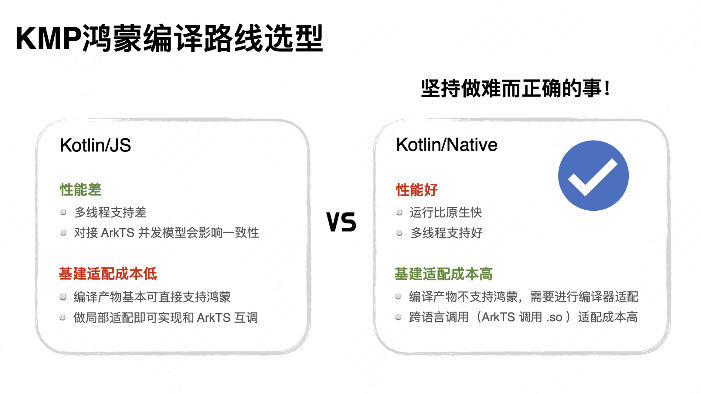
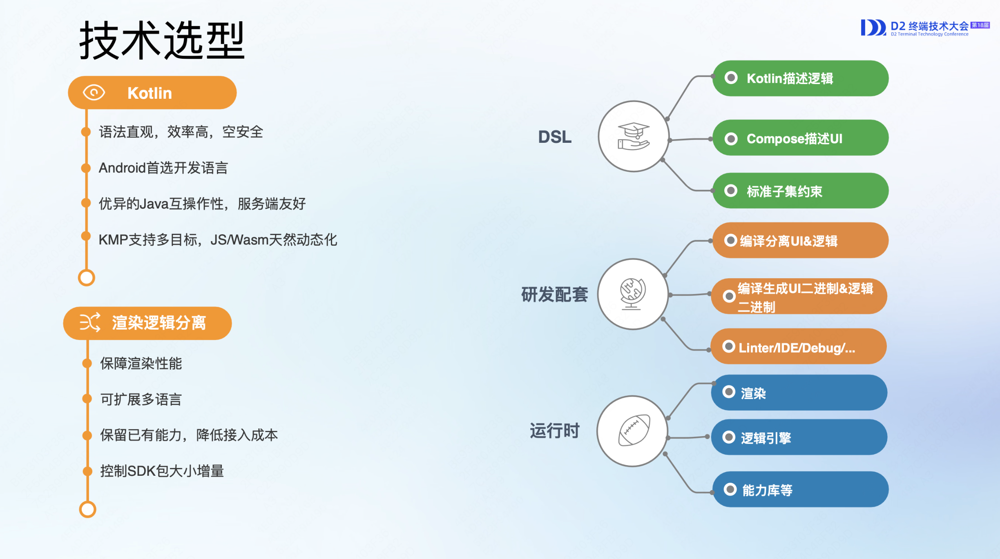
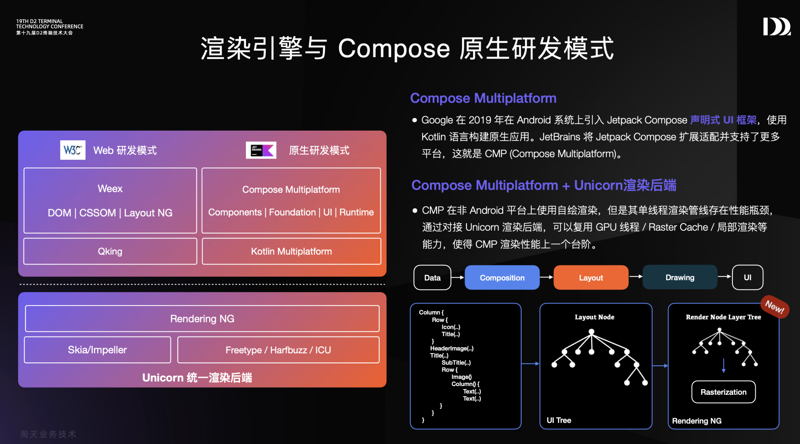

# 

都 2025 年了，还在犹豫要不要使用 Kotlin Multiplatform(KMP) 进行跨平台开发？

国内 KMP 实践案例收集，是官方 [Case Studies](https://www.jetbrains.com/help/kotlin-multiplatform-dev/case-studies.html)
的补充。
> 欢迎 PR，共同补充实践案例。

> 根据公开分享资料整理，若有侵权，请联系删除。 
> 若描述不准确，请联系或 PR 修改。

<table>
  <tr>
    <td>公司</td>
    <td>应用</td>
    <td>Kotlin Multiplatform(KMP) / Compose Multiplatform(CMP)</td>
    <td>公开分享</td>
    <td>简介</td>
  </tr>
  <tr>
    <td><a href="https://www.meituan.com">美团</a></td>
    <td>
        <ul>
            <li><a href="https://rms.meituan.com">美团收银智能版</a></li>
            <li><a href="https://apps.apple.com/cn/app/id1473911336">美团点餐助手智能版</a></li>
        </ul>
    </td>
    <td>
        <ul>
           <li></li>
           <li></li>
           <li></li>
       </ul>
    </td>
    <td>
        <ul>
          <li><a href="https://www.bilibili.com/video/BV1es421T71C">《Kotlin跨平台在餐饮SaaS的实践》-刘银龙</a></li>
          <li><a href="https://gmtc.infoq.cn/202302/beijing/presentation/4672">《KMM 在美团餐饮 SaaS 中的探索与实践》-刘银龙</a></li>
        </ul>
    </td>
    <td>
        

          
美团餐饮系统通过 KMP 实现了共 6 个终端 App 的逻辑层复用，覆盖 Android/iOS/Windows 三个平台。通过建设跨平台基础能力层，
            支撑核心业务逻辑层使用 KMP 进行代码复用，设计跨平台接入层给原生 UI 层调用。保证低端机交互体验的同时，提升了开发效率。
          

          
        

    </td>
  </tr>
  <tr>
    <td><a href="https://www.bilibili.com">哔哩哔哩</a></td>
    <td>
        <ul>
          <li><a href="https://apps.apple.com/cn/app/id736536022">哔哩哔哩</a></li>
        </ul>
    </td>
    <td>
        <ul>
            <li></li>
            <li></li>
            <li></li>
            <li></li>
        </ul>
    </td>
    <td>
        <ul>
          <li><a href="https://www.bilibili.com/video/BV1ntcJeJEsF">《BiliBili 的鸿蒙之路：从 Kotlin/JS 到 Kotlin/Native 的进化之路》-臧至聪</a></li>
          <li><a href="https://mp.weixin.qq.com/s/UajaKomk8XQTwn3BWLo6gw">《基于Kotlin Multiplatform的鸿蒙跨平台开发实践》-臧至聪 & 狒狒</a></li>
          <li><a href="https://b.geekbang.org/mall/events/qcon/2024/beijing/presentation/5753">《Kotlin Multiplatform 基于 Bazel 的逻辑层跨平台 (iOS、Android、Harmony) 实践》-张忻正</a></li>
        </ul>
    </td>
    <td>
        

          
哔哩哔哩 Android、iOS、鸿蒙三端采用 KMP 逻辑跨平台和原生 UI 开发。其中鸿蒙版适配，
            初期采用 Kotlin/JS 复用业务逻辑快速适配，为解决调试困难、性能瓶颈及多线程限制，转向 Kotlin/Native 方案。
            通过定制编译器和运行时支持鸿蒙工具链，适配生态基础库，并自研 NMB(Napi Module Binding) KSP 插件，实现 Kotlin 与 ArkTS 高效互操作。
            此外在探索 CMP 实现跨平台 UI 开发，进一步提升研发效率、同时保证用户体验。

          
        

    </td>
  </tr>
  <tr>
    <td><a href="https://www.tencent.com">腾讯</a></td>
    <td>
        <ul>
            <li><a href="https://apps.apple.com/cn/app/id444934666">QQ</a></li>
            <li><a href="https://apps.apple.com/cn/app/id458318329">腾讯视频</a></li>
        </ul>
    </td>
    <td>
        <ul>
            <li></li>
            <li></li>
            <li></li>
            <li></li>
        </ul>
    </td>
    <td>
        <ul>
          <li><a href="https://www.bilibili.com/video/BV1JtcJeJEoQ">《QQ NTCompose：一个基于 KMP 及 Compose 范式和原生渲染的多平台开发框架》-林锦涛</a></li>
          <li><a href="https://www.secon.vip/HarmonyOSNEXT">《腾讯视频 KMP 跨 Android、iOS、鸿蒙实践》-陈雄</a></li>
          <li><a href="https://www.bilibili.com/video/BV1ntcJeJEBb">《腾讯视频使用 KMP Compose 适配鸿蒙的实践》-王泽湘</a></li>
        </ul>
    </td>
    <td>
        

          
NTCompose 是腾讯 QQ 团队基于 KMP 和 Compose 构建的原生渲染跨端方案，支持 Android/iOS/鸿蒙/桌面/Web/小程序六端。
            通过跨平台 Compose Runtime 驱动各平台原生 UI 渲染，提供完全跨平台的声明式 UI 开发框架和逻辑 API 能力。
            适配鸿蒙采用纯 C++ 实现鸿蒙 Render、设计多线程渲染流程机制、使用 capi 命令式接口实现渲染协议等方案，
            首屏耗时比类 RN 框架快 5 倍。
          

          
        

         
        

          
腾讯视频基于 KMP 和 CMP 实现 Android/iOS/鸿蒙三端逻辑与 UI 统一，2024 年完成鸿蒙适配。
            通过深入研究 Kotlin/Native 编译器和运行时原理，攻克了函数内联、thread_local 及协程等性能难题，
            并通过移植 CMP Skia 渲染引擎对接鸿蒙 XComponent 来适配鸿蒙，解决原生混排、嵌套滑动、字体异常等问题。
          

          
        

    </td>
  </tr>
  <tr>
    <td><a href="https://www.kuaishou.com">快手</a></td>
    <td>
        <ul>
          <li><a href="https://apps.apple.com/cn/app/id440948110">快手</a></li>
        </ul>
    </td>
    <td>
        <ul>
            <li></li>
            <li></li>
            <li></li>
        </ul>
    </td>
    <td>
        <ul>
            <li><a href="https://qcon.infoq.cn/2025/beijing/presentation/6292">《存量互联网时代的大前端生存之道》-周全</a></li>
            <li><a href="https://www.bilibili.com/video/BV1ntcJeJEYd">《快手团队的 KMP 鸿蒙落地实践》-张人杰</a></li>
            <li><a href="https://www.bilibili.com/video/BV1Nn4y1X7yf">《KMP 到鸿蒙：基于 Cinterop 和 KSP 简化跨语言交互的实践》-车林阳</a></li>
        </ul>
    </td>
    <td>
        

          
快手鸿蒙版应用采用 KMP 逻辑跨平台 + ArkUI 原生 UI 开发，通过定制 Kotlin/Native 编译器支持鸿蒙工具链，
            自研 KNAPI 框架解决跨语言调用难题，基础库适配等，实现了移植 50% Android 存量逻辑代码、覆盖鸿蒙 70% 业务、整体提效 30%+。
          

          
        

    </td>
  </tr>
  <tr>
    <td><a href="https://www.kuaishou.com">阿里</a></td>
    <td>
        <ul>
          <li><a href="https://apps.apple.com/cn/app/id387682726">淘宝</a></li>
        </ul>
    </td>
    <td>
        <ul>
            <li></li>
            <li></li>
            <li></li>
            <li></li>
        </ul>
    </td>
    <td>
        <ul>
            <li><a href="https://d2.alibabatech.com/18">《基于KMP的原生研发框架新探索-DX4.0》-王康(正物)</a></li>
            <li><a href="https://d2.alibabatech.com/">《淘宝 weex 跨多端业务高效交付实践》-张翰(门柳) & 史健平(楚奕)</a></li>
        </ul>
    </td>
    <td>
        

          
淘宝 DX4.0 是基于 KMP 和 CMP 的新一代原生研发框架，旨在解决 XML/JSON 表达力不足、私有 DSL 学习成本高等问题。
            通过 Kotlin 描述逻辑与 Compose 描述 UI 来制定标准 DSL，提供配套 IDE 工具链，编译实现 UI 和逻辑分离。
            已应用于模板卡片等核心场景，兼顾开发效率与运行性能，推动集团原生研发模式升级。
          

          
        

         
        

          
淘宝 Weex 2.0 是新一代高性能跨端框架，通过自研渲染引擎 Unicorn、脚本引擎 Qking 实现标准化架构升级。
            支持 Android/iOS/鸿蒙等多端动态化，重构升级 LayoutNG 布局引擎、RenderingNG 渲染引擎以提升性能。
            完成鸿蒙平台适配并探索 Compose 融合方案，推动跨端技术向原生化、高性能方向演进。
          

          
        

    </td>
  </tr>

</table>
