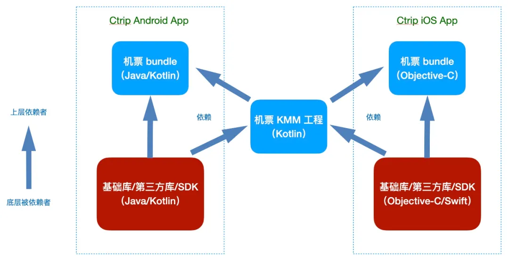
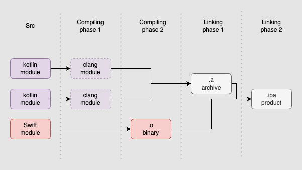
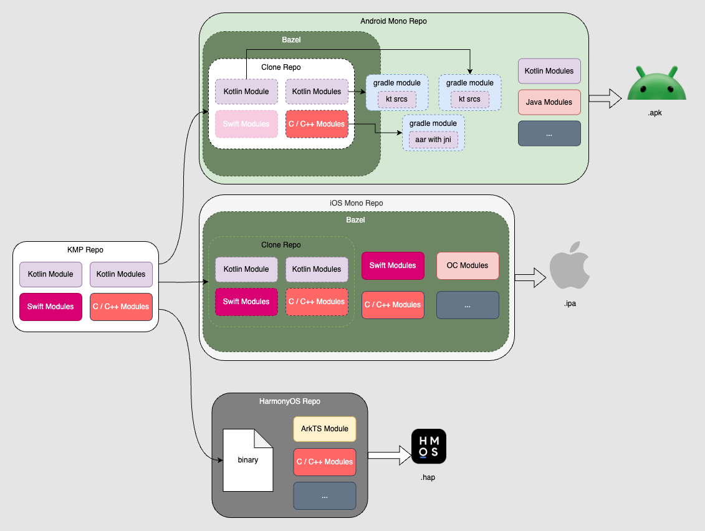
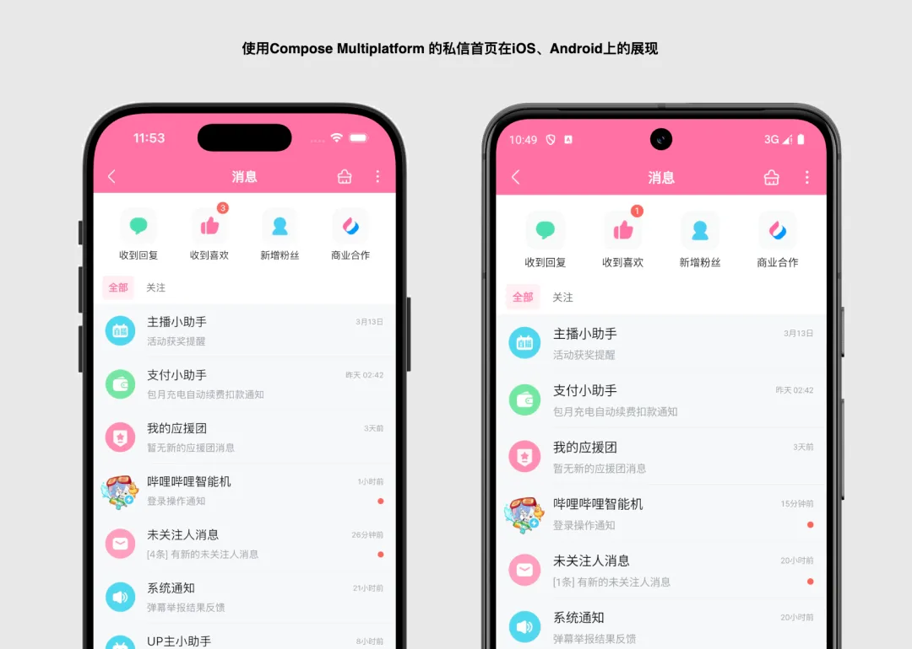
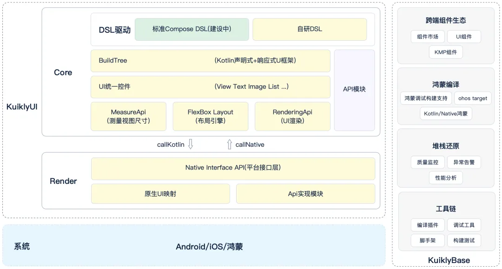
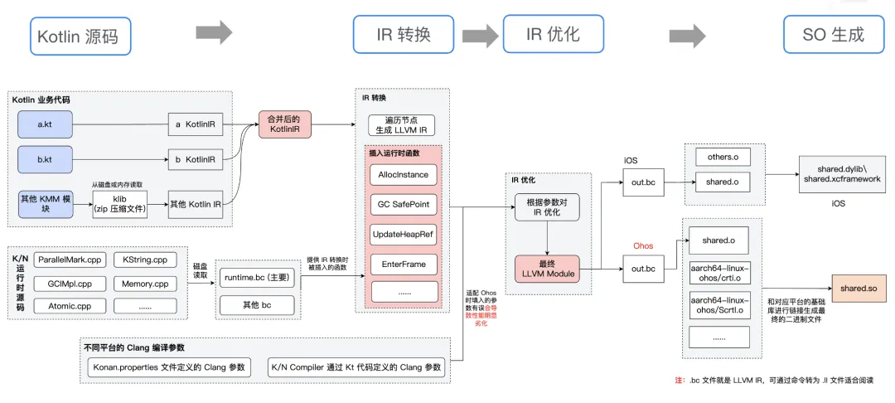
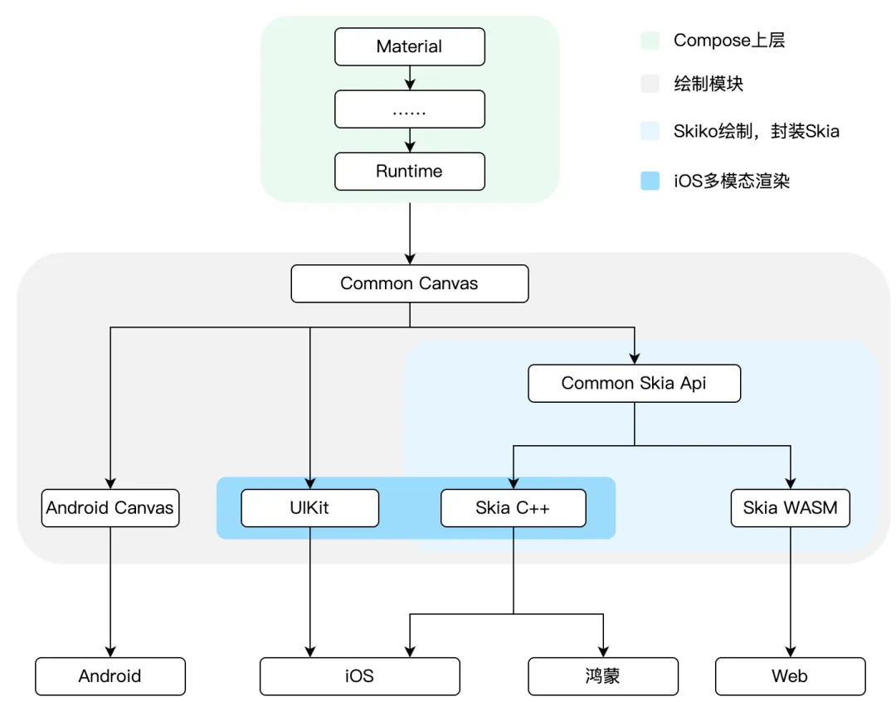
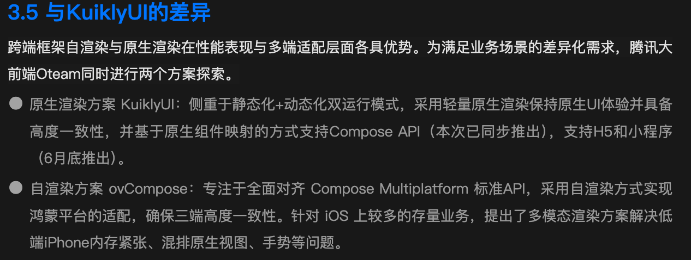
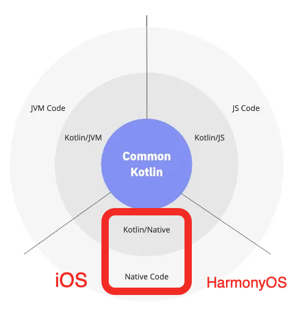

#   KMP case studies in China.

都 2025 年了，还在犹豫要不要使用 Kotlin Multiplatform(KMP) 进行跨平台开发？

国内 KMP 实践案例收集，是官方 [Case Studies](https://www.jetbrains.com/help/kotlin-multiplatform-dev/case-studies.html)
的补充。
> 欢迎 PR，共同补充实践案例。

> 根据公开分享资料整理，若有侵权，请联系删除。 
> 若描述不准确，请联系或 PR 修改。

<table>
  <tr>
    <td>公司</td>
    <td>应用</td>
    <td>Kotlin Multiplatform(KMP) / Compose Multiplatform(CMP)</td>
    <td>公开分享</td>
    <td>简介</td>
  </tr>
  <tr>
    <td><a href="https://www.meituan.com">美团</a></td>
    <td>
        <ul>
            <li><a href="https://rms.meituan.com">美团收银智能版</a></li>
            <li><a href="https://apps.apple.com/cn/app/id1473911336">美团点餐助手智能版</a></li>
        </ul>
    </td>
    <td>
        <ul>
           <li></li>
           <li></li>
           <li></li>
       </ul>
    </td>
    <td>
        <ul>
          <li><a href="https://www.bilibili.com/video/BV1es421T71C">《Kotlin跨平台在餐饮SaaS的实践》-刘银龙</a></li>
          <li><a href="https://gmtc.infoq.cn/202302/beijing/presentation/4672">《KMM 在美团餐饮 SaaS 中的探索与实践》-刘银龙</a></li>
        </ul>
    </td>
    <td>
        

          
美团餐饮系统通过 KMP 实现了共 6 个终端 App 的逻辑层复用，覆盖 Android/iOS/Windows 三个平台。通过建设跨平台基础能力层，
            支撑核心业务逻辑层使用 KMP 进行代码复用，设计跨平台接入层给原生 UI 层调用。保证低端机交互体验的同时，提升了开发效率。
          

          
        

    </td>
  </tr>
<tr>
    <td><a href="https://www.ctrip.com">携程</a></td>
    <td>
        <ul>
            <li><a href="https://apps.apple.com/cn/app/id379395415">携程</a></li>
        </ul>
    </td>
    <td>
        <ul>
           <li></li>
           <li></li>
       </ul>
    </td>
    <td>
        <ul>
          <li><a href="https://mp.weixin.qq.com/mp/appmsgalbum?action=getalbum&album_id=3944652285472636935">《携程技术-Kotlin专辑》-陈琦 & 乔禹昂 等</a></li>
          <li><a href="https://github.com/ctripcorp/SQLlin">《KMP ORM 框架》-乔禹昂</a></li>
          <li><a href="https://github.com/ctripcorp/mmkv-kotlin">《MVVM 的 KMP 封装》-乔禹昂</a></li>
        </ul>
    </td>
    <td>
        

          
国内 KMP 探索和推广者先驱。2020 年开始携程机票 Android 核心业务逐步由 Java 迁移至 Kotlin，2021 年初开始探索 KMP 
            来实现跨端业务逻辑复用。攻克了工程集成、基础组件 KMP 化、iOS cinterop 互操作、Kotlin/Native 异步并发模型等多个疑难问题。
            向业界输出多篇实践和原理性介绍，开源两个框架扩展 KMP 生态。
          

          
        

    </td>
  </tr>
  <tr>
    <td><a href="https://www.bilibili.com">哔哩哔哩</a></td>
    <td>
        <ul>
          <li><a href="https://apps.apple.com/cn/app/id736536022">哔哩哔哩</a></li>
        </ul>
    </td>
    <td>
        <ul>
            <li></li>
            <li></li>
            <li></li>
            <li></li>
        </ul>
    </td>
    <td>
        <ul>
          <li><a href="https://mp.weixin.qq.com/s/yRwkbQxFsRBNZW3Z-S1A8Q">《B站在KMP跨平台的业务实践之路》-肖志康 & Snorlax</a></li>
          <li><a href="https://www.bilibili.com/video/BV1ntcJeJEsF">《BiliBili 的鸿蒙之路：从 Kotlin/JS 到 Kotlin/Native 的进化之路》-臧至聪</a></li>
          <li><a href="https://mp.weixin.qq.com/s/UajaKomk8XQTwn3BWLo6gw">《基于Kotlin Multiplatform的鸿蒙跨平台开发实践》-臧至聪 & 狒狒</a></li>
          <li><a href="https://mp.weixin.qq.com/s/nRmwpSGlFgvROs1lRVuAIw">《工程化视角的 Kotlin Multiplatform核心解读及优化》-Snorlax</a></li>
          <li><a href="https://b.geekbang.org/mall/events/qcon/2024/beijing/presentation/5753">《Kotlin Multiplatform 基于 Bazel 的逻辑层跨平台 (iOS、Android、Harmony) 实践》-张忻正</a></li>
        </ul>
    </td>
    <td>
        

          
哔哩哔哩 Android、iOS、鸿蒙三端采用 KMP 逻辑跨平台和原生 UI 开发。其中鸿蒙版适配，
            初期采用 Kotlin/JS 复用业务逻辑快速适配，为解决调试困难、性能瓶颈及多线程限制，转向 Kotlin/Native 方案。
            通过定制编译器和运行时支持鸿蒙工具链，适配生态基础库，并自研 NMB(Napi Module Binding) KSP 插件，实现 Kotlin 与 ArkTS 高效互操作。
            此外在探索 CMP 实现 Android & iOS 跨平台 UI 开发，通过 UI 逻辑分离策略，在私信模块的成功落地。
            工程化方面，解读分析了 KMP 的构建系统，插件系统，IDEA 集成等等问题，并且提出了基于 Bazel 构建系统 和 Monorepo 的解决方案，实现了 Kotlin Swift Objective-C 三者之间的无缝互调和多语言混编，
            突破了官方所有的 KMP 模块只能聚合成为一个 framework 中的一个模块进行导出的限制，成为业界首个实现分模块导出的方案，甚至遥遥领先于官方。
          

          
          
          
          
        

    </td>
  </tr>
  <tr>
    <td><a href="https://www.tencent.com">腾讯</a></td>
    <td>
        <ul>
            <li><a href="https://apps.apple.com/cn/app/id444934666">QQ</a></li>
            <li><a href="https://apps.apple.com/cn/app/id458318329">腾讯视频</a></li>
        </ul>
    </td>
    <td>
        <ul>
            <li></li>
            <li></li>
            <li></li>
            <li></li>
        </ul>
    </td>
    <td>
        <ul>
          <li><a href="https://mp.weixin.qq.com/s/XiJJYdr59SV2wUwgjYJztQ">《腾讯开源跨平台开发框架 Kuikly，能显著提升多端开发效率》-Kuikly</a></li>
          <li><a href="https://mp.weixin.qq.com/s/eP3DxAkxX0z8xSMPY9q6TA">《腾讯Kuikly框架鸿蒙版正式开源 —— 揭秘卓越性能适配之旅》-Kuikly</a></li>
          <li><a href="https://www.bilibili.com/video/BV1JtcJeJEoQ">《QQ NTCompose：一个基于 KMP 及 Compose 范式和原生渲染的多平台开发框架》-林锦涛</a></li>
          <li><a href="https://mp.weixin.qq.com/s/GTkzHTvWIdDmxtlRVpNgfw">《重磅！支持纯血鸿蒙！腾讯视频ovCompose跨平台框架发布》-腾讯视频</a></li>
          <li><a href="https://www.secon.vip/HarmonyOSNEXT">《腾讯视频 KMP 跨 Android、iOS、鸿蒙实践》-陈雄</a></li>
          <li><a href="https://www.bilibili.com/video/BV1ntcJeJEBb">《腾讯视频使用 KMP Compose 适配鸿蒙的实践》-王泽湘</a></li>
        </ul>
    </td>
    <td>
        

          
Kuikly 是腾讯广泛使用的跨端开发框架，基于 Kotlin Multiplatform 技术构建，为开发者了提供技术栈更统一的跨端开发体验。
            Kuikly 已在腾讯内部大规模应用，目前覆盖 QQ、腾讯新闻、QQ 音乐、搜狗输入法、QQ 浏览器等 15+ 款 APP 、落地 500+ 业务页面，
            日均 PV 达亿级。已在业务中广泛使用，显著提升了多端开发效率。
            部分业务在鸿蒙端完全采用 Kuikly 进行开发，进而复用到Android 和 iOS ，显著提升了跨端开发效率。
            框架整体分为 KuiklyBase 和 KuiklyUI 两部分，其中KuiklyBase 与腾讯视频 ovCompose 共建复用。
            具备一码五端，支持鸿蒙平台，原生级性能体验，Kotlin 语言驱动，纯原生开发工具链，声明+响应式 DSL，支持页面级动态化，轻量稳定易维护，高一致性原生渲染方案.
          

          
          
        

         
        

          
ovCompose（online-video-compose）是腾讯大前端领域Oteam中，腾讯视频团队基于 Compose Multiplatform 生态推出的跨平台开发框架，
            旨在弥补JetBrains Compose Multiplatform不支持鸿蒙平台的遗憾与解决iOS平台混排受限的问题，便于业务构建全跨端App。
            同时腾讯视频深度参与Oteam并推出了KuiklyBase，涵盖Kotlin/Native的鸿蒙适配、组件生态、鸿蒙编译、堆栈还原、工具链相关建设，助力业界KMP开发者提高鸿蒙适配效率。
            ovCompose已经在腾讯视频鸿蒙平台全面落地，成为鸿蒙平台首个全跨端APP。随着鸿蒙系统的发展，ovCompose 和 KuiklyBase 也会在未来进一步扩展到TV和PC端。
            采用高性能的 Kotlin/Native 方案适配鸿蒙，鸿蒙三明治架构（Skia 渲染使用 XComponent 组件作为画布）支持混排，三端高一致性。
            iOS 端采用了指令映射（使用 UIKit 实现Compose Canvas）的多模态渲染自研实现方案，解放混排能力，解决了 Compose 在 iOS 上面临的诸多难题。
            业务团队甚至可以根据实际应用场景在基于 UIKit 实现的自研指令映射方案或官方的Skia渲染方案之间进行自由切换，并且可以在 Runtime 期共存。
            并进行了大量 Kotlin/Native 性能优化，包括 GC 优化（GC 抑制、GC 分段、Sweep 优化），堆 Dump 优化等。
            为 KuiklyBase 组件生态建设了堆栈还原、ArkTS 互调用、逻辑组件、UI 组件等多个组件。
          

          
          
        

    </td>
  </tr>
  <tr>
    <td><a href="https://www.kuaishou.com">快手</a></td>
    <td>
        <ul>
          <li><a href="https://apps.apple.com/cn/app/id440948110">快手</a></li>
        </ul>
    </td>
    <td>
        <ul>
            <li></li>
            <li></li>
            <li></li>
        </ul>
    </td>
    <td>
        <ul>
            <li><a href="https://qcon.infoq.cn/2025/beijing/presentation/6292">《存量互联网时代的大前端生存之道》-周全</a></li>
            <li><a href="https://www.bilibili.com/video/BV1ntcJeJEYd">《快手团队的 KMP 鸿蒙落地实践》-张人杰</a></li>
            <li><a href="https://www.bilibili.com/video/BV1Nn4y1X7yf">《KMP 到鸿蒙：基于 Cinterop 和 KSP 简化跨语言交互的实践》-车林阳</a></li>
        </ul>
    </td>
    <td>
        

          
快手鸿蒙版应用采用 KMP 逻辑跨平台 + ArkUI 原生 UI 开发，通过定制 Kotlin/Native 编译器支持鸿蒙工具链，
            自研 KNAPI 框架解决跨语言调用难题，基础库适配等，实现了移植 50% Android 存量逻辑代码、覆盖鸿蒙 70% 业务、整体提效 30%+。
          

          
        

    </td>
  </tr>
  <tr>
    <td><a href="https://www.kuaishou.com">阿里</a></td>
    <td>
        <ul>
          <li><a href="https://apps.apple.com/cn/app/id387682726">淘宝</a></li>
          <li><a href="https://apps.apple.com/cn/app/id333206289">支付宝</a></li>
        </ul>
    </td>
    <td>
        <ul>
            <li></li>
            <li></li>
            <li></li>
            <li></li>
        </ul>
    </td>
    <td>
        <ul>
            <li><a href="https://d2.alibabatech.com/18">《基于KMP的原生研发框架新探索-DX4.0》-王康(正物)</a></li>
            <li><a href="https://d2.alibabatech.com/">《淘宝 weex 跨多端业务高效交付实践》-张翰(门柳) & 史健平(楚奕)</a></li>
            <li><a href="https://mp.weixin.qq.com/s/vcuo2YJsrn3kQcTNuoLuGQ">《支付宝客户端 Kotlin/Native 包体积优化实践》-李皓骅(亿晨)</a></li>
        </ul>
    </td>
    <td>
        

          
淘宝 DX4.0 是基于 KMP 和 CMP 的新一代原生研发框架，旨在解决 XML/JSON 表达力不足、私有 DSL 学习成本高等问题。
            通过 Kotlin 描述逻辑与 Compose 描述 UI 来制定标准 DSL，提供配套 IDE 工具链，编译实现 UI 和逻辑分离。
            已应用于模板卡片等核心场景，兼顾开发效率与运行性能，推动集团原生研发模式升级。
          

          
        

         
        

          
淘宝 Weex 2.0 是新一代高性能跨端框架，通过自研渲染引擎 Unicorn、脚本引擎 Qking 实现标准化架构升级。
            支持 Android/iOS/鸿蒙等多端动态化，重构升级 LayoutNG 布局引擎、RenderingNG 渲染引擎以提升性能。
            完成鸿蒙平台适配并探索 Compose 融合方案，推动跨端技术向原生化、高性能方向演进。
          

          
        

         
        

          
支付宝客户端引入了基于 Kotlin Multiplatform (KMP) 的原生跨端开发模式，进行三端一码（即 Android、iOS、鸿蒙使用同一套代码）。
            Android 平台采用了 Kotlin/JVM。iOS 和鸿蒙平台则使用了 Kotlin/Native（未来可能扩展到 Kotlin/JS 或 Kotlin/Wasm）。
            同时，引入 Compose Multiplatform (CMP) 作为跨端 UI 方案 ，并且使用了一些如 Lottie（Compottie） 等第三方库。
            面对包大小体积的挑战，深入分析和挖掘 Kotlin/Native 编译出的代码，实践总结一些优化方法，
            主要包括包括：编译参数优化、精细管理导出符号 + DCE 的优化方法（暂时未讨论 Kotlin/JVM 等情况）。
            成功降低了支付宝客户端的安装包大小，iOS Framework 编译后的二进制产物体积从 28MB 减少到 15MB。
            支付宝 iOS 整个 IPA 包体积减少约 4.4MB。鸿蒙（OHOS）平台 KMP 动态库在进行 strip 优化后体积减少约 8MB。
            降低新接入 KMP 和 CMP 框架的独立应用的初次安装包体积成本，让跨端技术更加高效、经济地落地。
          

          
        

    </td>
  </tr>
  <tr>
    <td><a href="https://www.moonshot.cn/">月之暗面</a></td>
    <td>
        <ul>
          <li><a href="https://kimi.moonshot.cn/">Kimi</a></li>
        </ul>
    </td>
    <td>
        <ul>
            <li></li>
            <li></li>
            <li></li>
            <li></li>
        </ul>
    </td>
    <td>
        <ul>
            <li><a href="topics/case-studies-cn/Kimi.md">Kimi 客户端跨端开发实践：基于 KMP+CMP 的探索与实现</a></li>
        </ul>
    </td>
    <td>
        

          
Kimi 客户端团队通过 KMP+CMP 跨端开发方案，成功实现了 PC 和 Android 双端的 UI 及逻辑代码共享，并进一步拓展至 PC、鸿蒙和 Android 三端的逻辑代码共享，显著提升了开发效率和代码复用性。
          

        

    </td>
  </tr>

</table>
